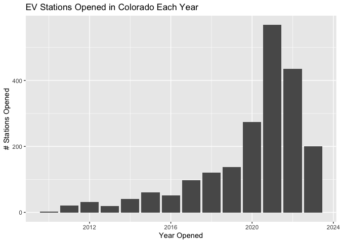
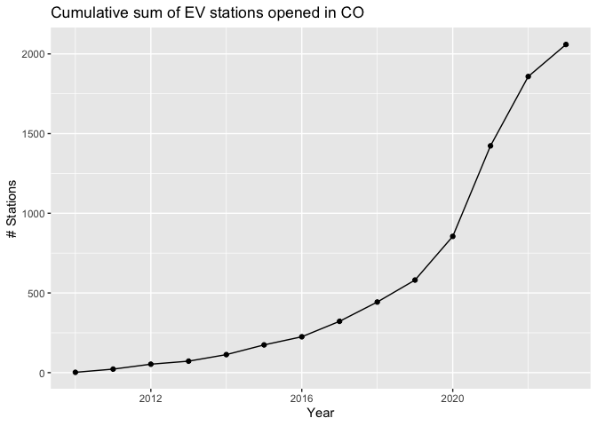
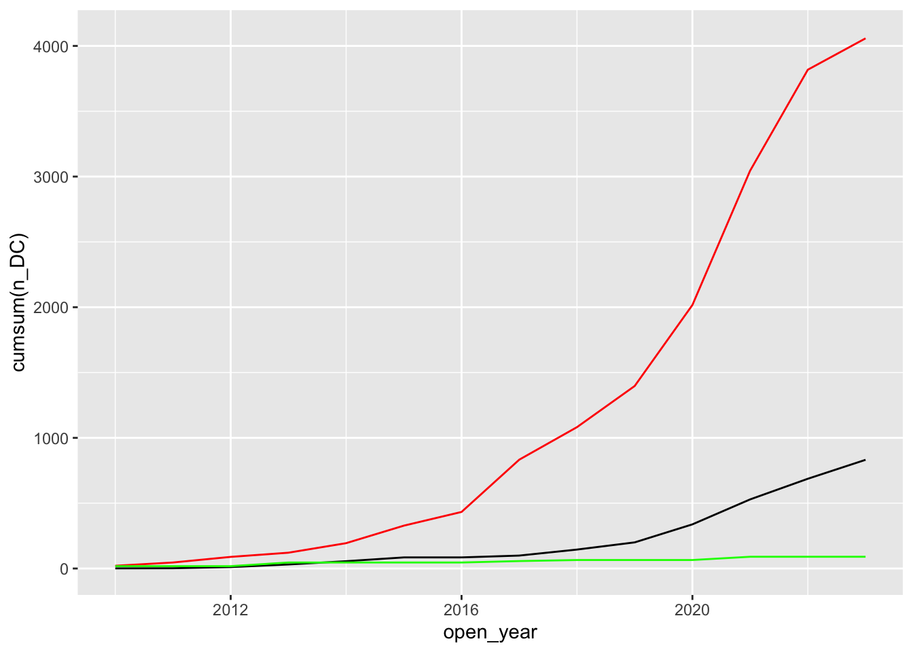
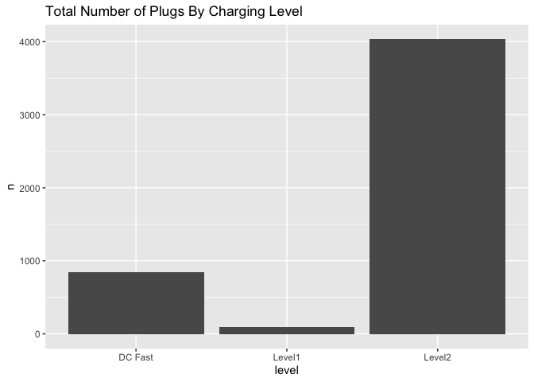
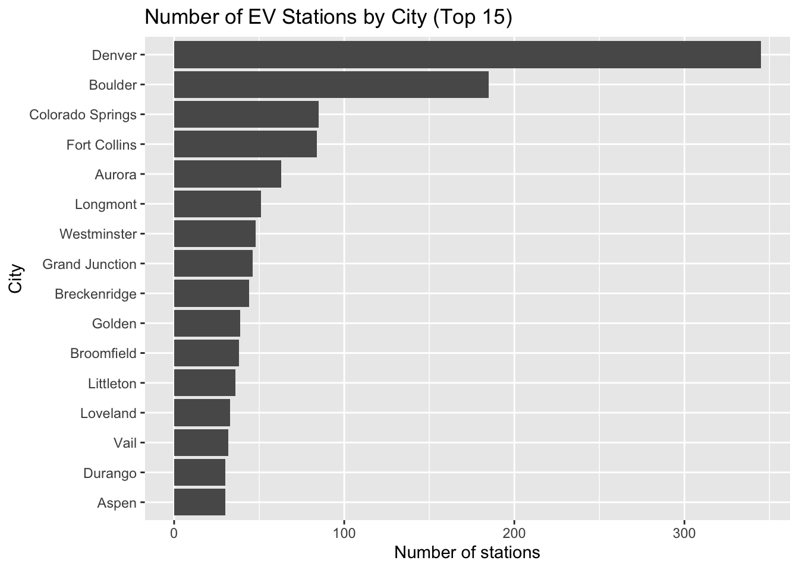

## Load Data For EV stations in Colorado

- I'll retrieve the EV station data using the AFDC API. The documentation for the AFDC fuel-stations API can be found at: <https://developer.nrel.gov/docs/transportation/alt-fuel-stations-v1/all/#station-count-record-fields>

- You can obtain a free API key at: [<https://developer.nrel.gov/signup/>]. I've saved my API key in my local .Renviron file so I can load it without exposing the key in my code.

- For now I will request all EV (electric fuel type) stations in Colorado.


```r
# API key is stored in my .Renviron file
api_key <- Sys.getenv("AFDC_KEY")

# base url for AFDC alternative fuel stations API
target <- "https://developer.nrel.gov/api/alt-fuel-stations/v1"

# Return data for all electric stations in Colorado
api_path <-".json?&fuel_type=ELEC&state=CO&limit=all"

complete_api_path <- paste0(target,api_path,'&api_key=',api_key)

dat <- httr::GET(url=complete_api_path)

dat2 <- jsonlite::fromJSON(httr::content(dat,"text"))

print(paste(dat2$total_results,'Stations Found'))
```

```
## [1] "2063 Stations Found"
```

```r
df <- dat2$fuel_stations

#str(df)
```

### Filter out non-EV data columns

The returned data contains many non-electric fields that we don't need (they will all be NA since we requested electric fuel type only):


```r
colnames(df)
```

```
##  [1] "access_code"                "access_days_time"          
##  [3] "access_detail_code"         "cards_accepted"            
##  [5] "date_last_confirmed"        "expected_date"             
##  [7] "fuel_type_code"             "groups_with_access_code"   
##  [9] "id"                         "open_date"                 
## [11] "owner_type_code"            "status_code"               
## [13] "restricted_access"          "maximum_vehicle_class"     
## [15] "station_name"               "station_phone"             
## [17] "updated_at"                 "facility_type"             
## [19] "geocode_status"             "latitude"                  
## [21] "longitude"                  "city"                      
## [23] "intersection_directions"    "plus4"                     
## [25] "state"                      "street_address"            
## [27] "zip"                        "country"                   
## [29] "bd_blends"                  "cng_dispenser_num"         
## [31] "cng_fill_type_code"         "cng_psi"                   
## [33] "cng_renewable_source"       "cng_total_compression"     
## [35] "cng_total_storage"          "cng_vehicle_class"         
## [37] "cng_has_rng"                "e85_blender_pump"          
## [39] "e85_other_ethanol_blends"   "ev_connector_types"        
## [41] "ev_dc_fast_num"             "ev_level1_evse_num"        
## [43] "ev_level2_evse_num"         "ev_network"                
## [45] "ev_network_web"             "ev_other_evse"             
## [47] "ev_pricing"                 "ev_renewable_source"       
## [49] "hy_is_retail"               "hy_pressures"              
## [51] "hy_standards"               "hy_status_link"            
## [53] "lng_renewable_source"       "lng_vehicle_class"         
## [55] "lng_has_rng"                "lpg_primary"               
## [57] "lpg_nozzle_types"           "ng_fill_type_code"         
## [59] "ng_psi"                     "ng_vehicle_class"          
## [61] "rd_blends"                  "rd_blends_fr"              
## [63] "rd_blended_with_biodiesel"  "rd_max_biodiesel_level"    
## [65] "nps_unit_name"              "access_days_time_fr"       
## [67] "intersection_directions_fr" "bd_blends_fr"              
## [69] "groups_with_access_code_fr" "ev_pricing_fr"             
## [71] "ev_network_ids"             "federal_agency"
```

I'll remove a bunch of the non-relevant fields from the data frame to clean things up a bit. I'll also change the date column type and add a variable for year opened.


```r
# filter out non-EV related fields
df <- df %>% select(-starts_with("lng")) %>% 
  select(-starts_with("cng")) %>%
  select(-starts_with("lpg")) %>%
  select(-starts_with("hy")) %>% 
  select(-starts_with("ng")) %>% 
  select(-starts_with("e85")) %>% 
  select(-starts_with("bd")) %>% 
  select(-starts_with("rd"))


# change date field to date type and add a year opened variable
df$open_date <- lubridate::ymd(df$open_date)
df$open_year <- lubridate::year(df$open_date)

colnames(df)
```

```
##  [1] "access_code"                "access_days_time"          
##  [3] "access_detail_code"         "cards_accepted"            
##  [5] "date_last_confirmed"        "expected_date"             
##  [7] "fuel_type_code"             "groups_with_access_code"   
##  [9] "id"                         "open_date"                 
## [11] "owner_type_code"            "status_code"               
## [13] "restricted_access"          "maximum_vehicle_class"     
## [15] "station_name"               "station_phone"             
## [17] "updated_at"                 "facility_type"             
## [19] "geocode_status"             "latitude"                  
## [21] "longitude"                  "city"                      
## [23] "intersection_directions"    "plus4"                     
## [25] "state"                      "street_address"            
## [27] "zip"                        "country"                   
## [29] "ev_connector_types"         "ev_dc_fast_num"            
## [31] "ev_level1_evse_num"         "ev_level2_evse_num"        
## [33] "ev_network"                 "ev_network_web"            
## [35] "ev_other_evse"              "ev_pricing"                
## [37] "ev_renewable_source"        "nps_unit_name"             
## [39] "access_days_time_fr"        "intersection_directions_fr"
## [41] "groups_with_access_code_fr" "ev_pricing_fr"             
## [43] "ev_network_ids"             "federal_agency"            
## [45] "open_year"
```

```r
#str(df)
```


## Station Openings Over Time

### Look at how many stations opened each year

First I'd like to look at how many EV stations opened over time, so I'll make a new data frame summarizing the number of stations opened by year.


```r
df_opened <- df %>% 
  count(open_year,name = "nopened")  

df_opened
```

```
##    open_year nopened
## 1       2010       2
## 2       2011      20
## 3       2012      31
## 4       2013      19
## 5       2014      41
## 6       2015      61
## 7       2016      51
## 8       2017      97
## 9       2018     121
## 10      2019     138
## 11      2020     274
## 12      2021     568
## 13      2022     435
## 14      2023     201
## 15        NA       4
```

#### Plot Number of Stations Opened Each year


```r
df_opened %>% ggplot(aes(open_year, nopened)) + 
  geom_col()+
  xlab("Year Opened")+
  ylab("# Stations Opened")+
  ggtitle('EV Stations Opened in Colorado Each Year')
```

```
## Warning: Removed 1 rows containing missing values (`position_stack()`).
```

<!-- -->

#### Plot cumulative sum of stations opened over time

We can also look at the cumulative sum of stations opened over time


```r
df_opened %>% ggplot(aes(open_year,cumsum(nopened)))+
  geom_line()+
  geom_point()+
  xlab("Year")+
  ylab("# Stations")+
  ggtitle("Cumulative sum of EV stations opened in CO")
```

```
## Warning: Removed 1 row containing missing values (`geom_line()`).
```

```
## Warning: Removed 1 rows containing missing values (`geom_point()`).
```

<!-- -->

### Station openings by level/charger type

Next I want to dig a little deeper and break down the station openings by charger type and/or level. I'd expect to see an increase in DC fast charging stations in more recent years. I'll make a new data frame with the number of chargers opened by year, grouped by charging level (Level 1, Level 2, or DC fast).


```r
df_opened_level <- df %>% select(id,open_date,open_year,ev_dc_fast_num,ev_level2_evse_num,ev_level1_evse_num) %>%
  group_by(open_year) %>%
  summarize(n_DC=sum(ev_dc_fast_num,na.rm = TRUE), 
            n_L2=sum(ev_level2_evse_num,na.rm = TRUE),
            n_L1=sum(ev_level1_evse_num,na.rm = TRUE) )

df_opened_level
```

```
## # A tibble: 15 × 4
##    open_year  n_DC  n_L2  n_L1
##        <dbl> <int> <int> <int>
##  1      2010     1    21    18
##  2      2011     1    25     0
##  3      2012     9    43     0
##  4      2013    20    32    28
##  5      2014    25    73     0
##  6      2015    29   134     0
##  7      2016     0   105     0
##  8      2017    14   400    11
##  9      2018    46   249     8
## 10      2019    57   315     0
## 11      2020   150   622     0
## 12      2021   195  1029    25
## 13      2022   158   754     0
## 14      2023   134   216     0
## 15        NA     0    14     0
```

To make plotting easier, I'll pivot ('melt') the dataframe from wide to long format so I can group by charnging level:


```r
df_opened_level_long <- df_opened_level %>% 
  tidyr::pivot_longer(cols=c('n_DC','n_L2','n_L1'), names_to = "Level", names_prefix = "n_", values_to = "n_opened")

df_opened_level_long
```

```
## # A tibble: 45 × 3
##    open_year Level n_opened
##        <dbl> <chr>    <int>
##  1      2010 DC           1
##  2      2010 L2          21
##  3      2010 L1          18
##  4      2011 DC           1
##  5      2011 L2          25
##  6      2011 L1           0
##  7      2012 DC           9
##  8      2012 L2          43
##  9      2012 L1           0
## 10      2013 DC          20
## # ℹ 35 more rows
```


```r
df_opened_level_long %>% 
  ggplot(aes(open_year, n_opened, group=Level)) +
  geom_line(aes(col=Level))+
  geom_point(aes(col=Level))+
  xlab("Year Opened")+
  ylab("# Charges Opened")+
  ggtitle("Number of Chargers Opened Per Year")
```

```
## Warning: Removed 3 rows containing missing values (`geom_line()`).
```

```
## Warning: Removed 3 rows containing missing values (`geom_point()`).
```

<!-- -->

Cumulative sum of chargers added by level


```r
df_opened_level %>% ggplot()+
  geom_line(aes(open_year,cumsum(n_DC)),col='black')+
  geom_line(aes(open_year,cumsum(n_L2)),col='red')+
  geom_line(aes(open_year,cumsum(n_L1)),col='green')
```

```
## Warning: Removed 1 row containing missing values (`geom_line()`).
## Removed 1 row containing missing values (`geom_line()`).
## Removed 1 row containing missing values (`geom_line()`).
```

<!-- -->


## Count \# individual plugs by level


```r
n_lev1 <- sum(df$ev_level1_evse_num,na.rm=TRUE)
n_lev2 <- sum(df$ev_level2_evse_num,na.rm=TRUE)
n_dcfast <- sum(df$ev_dc_fast_num, na.rm=TRUE)

plugs <- tibble(level=c('Level1','Level2','DC Fast'), n=c(n_lev1,n_lev2,n_dcfast))

plugs %>% ggplot(aes(level,n))+
  geom_col()+
  ggtitle("Total Number of Plugs By Charging Level")
```

<!-- -->

<!-- ## Break down by connector types, ev_connector_type,ev_charging_level -->

<!-- ```{r } -->

<!-- #unique(unlist(df$ev_connector_types)) -->

<!-- df4 <- df3 %>% rowwise() %>%  -->

<!--   mutate(hasJ=if_else("J1772" %in% ev_connector_types,1,0)) %>%  -->

<!--   mutate(hasJcomb=if_else("J1772COMBO" %in% ev_connector_types,1,0)) %>%  -->

<!--   mutate(hasChad=if_else("CHADEMO" %in% ev_connector_types,1,0)) %>%  -->

<!--   mutate(hasTesla=if_else("TESLA" %in% ev_connector_types,1,0)) %>%  -->

<!--   mutate(hasNema520=if_else("NEMA520" %in% ev_connector_types,1,0)) %>%  -->

<!--   mutate(hasNema515=if_else("NEMA515" %in% ev_connector_types,1,0)) %>%  -->

<!--   mutate(hasNema1450=if_else("NEMA1450" %in% ev_connector_types,1,0)) -->

<!--   View(df4) -->

<!-- df4 %>% -->

<!--   select_if(is.numeric) %>% -->

<!--   map_dbl(sum)   -->

<!-- tibble(connector_type=names(df5),n=df5) %>% View() -->

<!-- ``` -->

<!-- ```{r } -->

<!-- #df %>% count(ev_network) %>% arrange(desc(n)) %>% View() -->

<!-- df %>%  count(ev_network) %>%  -->

<!--   mutate(ev_network=as.factor(ev_network)) %>%  -->

<!--   mutate(ev_network=forcats::fct_reorder(ev_network,n)) %>%  -->

<!--   ggplot(aes(ev_network,n))+ -->

<!--   geom_col()+ -->

<!--   coord_flip()+ -->

<!--   xlab("EV Network")+ -->

<!--   ylab("# stations") -->

<!-- ``` -->

## Break down by city/county


```r
df %>% count(city) %>%
  slice_max(order_by=n,n=15) %>%
  mutate(city=forcats::fct_reorder(city,n)) %>%
  ggplot(aes(city,n))+
  geom_col()+
  coord_flip()+
  ggtitle("Number of EV Stations by City (Top 15)")+
  xlab("City")+
  ylab("Number of stations")
```

<!-- -->

```r
#  View()
```
